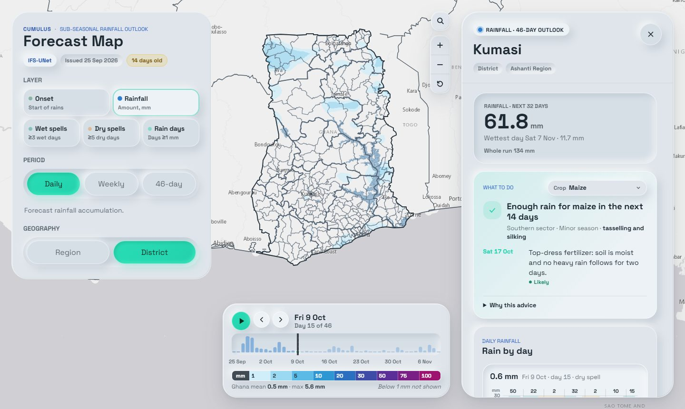

# Cumulus Frontend

Interactive 46-day rainfall outlook for Ghana, with district- and region-level farm advice.

**Live:** https://cumulus-gh.vercel.app · **Backend:** [`cumulus-backend`](https://github.com/samankwah/cumulus-backend)



## Features

- **46-day outlook:** ECMWF IFS extended-range forecasts, downscaled with a UNet. Five map layers:
  - onset of rains
  - rainfall
  - wet-spell days
  - dry-spell days
  - rainy days
- **Timeline:** view layers day by day, week by week or as a 46-day total, and press play to animate. Onset is shown by day or as an onset date. A national-rainfall bar chart sits behind the slider.
- **Regions and districts:** hover any of Ghana's 16 regions or 259 districts for its area value. Click an area, or any point on the map, to open the drawer with:
  - the rainfall series and weekly totals
  - spell and onset dates
  - **What to do:** crop-specific advice for maize, rice, sorghum & millet, groundnut & cowpea, yam & cassava, or vegetables
- **Search:** the 🔍 button finds any region, any district (by short or official name) or any of the 16 regional capitals, then selects it and zooms to it.
- **Shareable state:** the URL keeps the layer, period, day and selection, and the browser tab names the selected area, e.g. `Accra Onset - Accra Metro District, Ghana`.
- **Seasonal outlook:** the wass2s seasonal view is still in the code but hidden by default. See [Configuration](#configuration).

The map runs entirely in the browser: a Next.js 14 App Router app using React 18, TypeScript and React Leaflet. The backend renders the forecast map tiles, and the boundary GeoJSON files are in `public/data/`.

## Quick start

Requires Node 20–24 and the [backend](https://github.com/samankwah/cumulus-backend) running on `http://127.0.0.1:8000`. Both repos are expected side by side:

```
cumulus-gh/
  cumulus-frontend/   <- this repo
  cumulus-backend/
```

```powershell
copy .env.example .env.local
npm install
npm run dev          # http://localhost:3000
```

`npm run dev` starts a custom Next dev server (`scripts/start-development.mjs`). It avoids the `spawn EPERM` error the plain Next CLI can hit on Windows; `npm run dev:next` runs the plain Next CLI.

## Configuration

Set these in `.env.local`. They are inlined at **build time**, so rebuild after changing them.

| Variable | Default | Purpose |
| --- | --- | --- |
| `NEXT_PUBLIC_API_BASE_URL` | `https://cumulus-backend.vercel.app` | Backend base URL. Use `http://127.0.0.1:8000` for local development. |
| `NEXT_PUBLIC_ENABLE_SEASONAL` | `0` | Set to `1` to show the seasonal outlook switch. |

### URL parameters

Links restore the view, for example `/?layer=onset&area=district&name=Accra`.

| Parameter | Values |
| --- | --- |
| `layer` | `onset`, `rainfall`, `wet_spell_days`, `dry_spell_days`, `rainy_days` |
| `agg` | `daily`, `weekly`, `total` |
| `day`, `week` | 1-based index into the run |
| `area`, `name` | `region` or `district`, plus the area's name |
| `lat`, `lon` | a map point |
| `run` | a specific run ID; the latest run is used if omitted |

## Scripts

| Command | What it does |
| --- | --- |
| `npm run dev` | Development server with hot reload. |
| `npm run build` / `npm start` | Production build and server. |
| `npm run typecheck` | `tsc --noEmit` |
| `npm run smoke` | Builds, then runs the Playwright suite against a mocked API. Needs Chrome. |
| `npm run smoke:integration` | Builds, then runs Playwright against the real backend in `../cumulus-backend`, or in `CUMULUS_BACKEND_DIR` if set. |

The `smoke` scripts use Windows `cmd` syntax. `start-frontend-local.ps1` and `start-frontend-production-local.ps1` start one server each, and refuse to start if port 3000 is already in use (pass `-ForceRestart` to replace it).

## Deployment

The `main` branch deploys to Vercel. Set `NEXT_PUBLIC_API_BASE_URL` in the Vercel project, or leave it unset to use the production backend. The backend allows requests from `https://cumulus-gh.vercel.app` and its preview URLs.

## Project structure

```
app/                 layout, page and global styles
components/
  dashboard-shell.tsx      page state, URL sync, tab title
  forecast-raster-map.tsx  Leaflet map, boundaries, selection
  area-search.tsx          region / district / capital search
  subseasonal/             46-day panel, timeline, legend, drawer, advice
hooks/               use-subseasonal (46-day state), use-cumulus-dashboard (seasonal)
lib/                 API client, map data, labels, advice rules
public/data/         Ghana boundary and water GeoJSON
tests/               Playwright specs and fixtures
```

## Troubleshooting

- **`Cannot find module './NNN.js'` or 404s for hashed chunks:** `next build` and the dev server share `.next`, so building while `npm run dev` is running breaks it. Stop the server, delete `.next`, and start again.
- **"Could not reach the 46-day forecast service":** check that the backend is running and that `NEXT_PUBLIC_API_BASE_URL` points to it. On a new domain, the backend's CORS settings must allow that origin.
